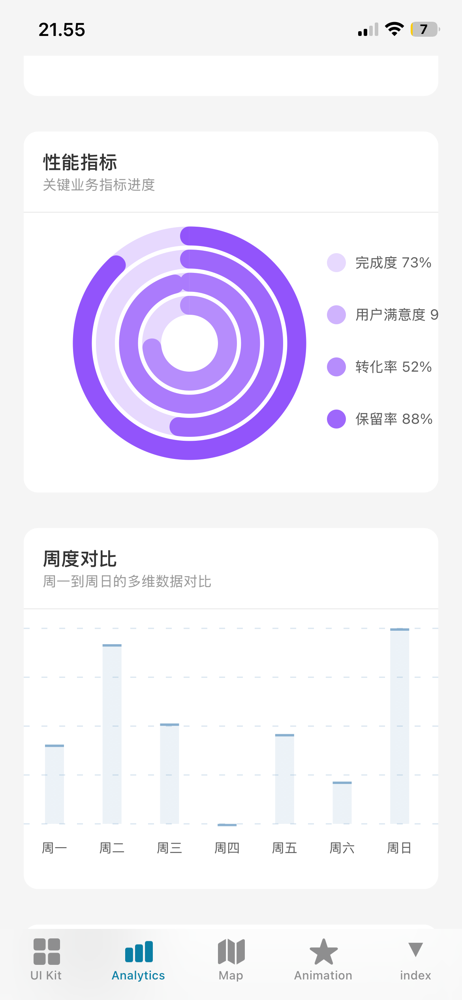
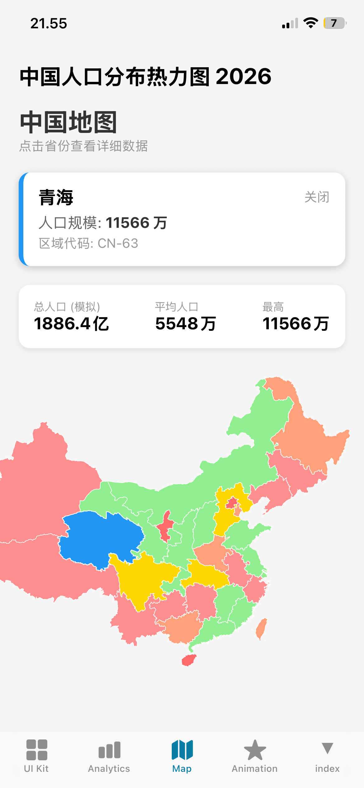
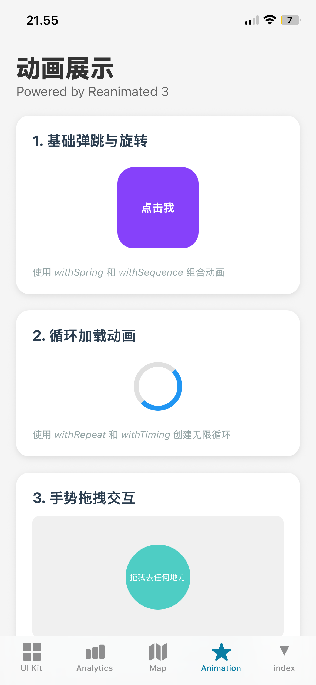
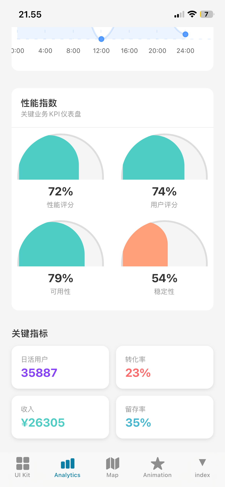
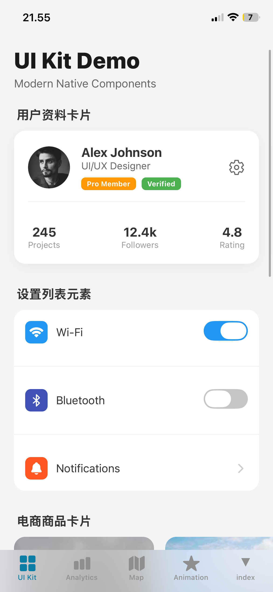
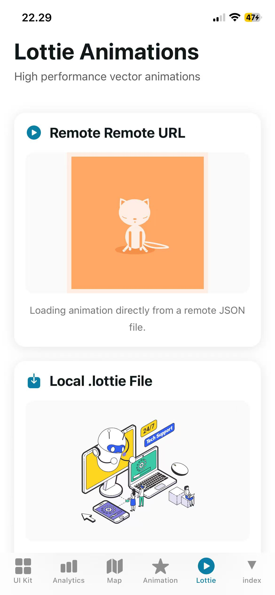

# Expo UI Kit & Map Demo

**English** | [中文](./README_ZH.md)

A modern React Native demonstration app built with **Expo**, featuring advanced UI patterns, interactive data visualization, and high-performance animations.

## 📱 Features

### 1. 🗺️ Interactive China Heatmap
- **SVG-based Rendering**: High-performance vector map using `react-native-svg`.
- **Interactive**: Touch handling for individual provinces with visual feedback.
- **Data Visualization**: Heatmap coloring based on simulated population data.
- **Details Panel**: Slide-up cards showing detailed statistics for selected regions.

### 2. 🎨 Modern UI Kit
- **Glassmorphism**: "Liquid Glass" tab bar and card effects using `expo-blur`.
- **Native Components**:
    - User Profile Cards with badges.
    - E-commerce Product ScrollViews.
    - Settings Lists with toggle switches.
    - Styled Form Inputs.

### 3. ✨ Advanced Animations
Powered by **React Native Reanimated 3** and **Gesture Handler**:
- **3D Flip Cards**: Realistic card flipping with `rotateY` interpolation.
- **Accordion**: Smooth height transitions for expandable content.
- **Pulse Ripple**: Infinite radar-like looping animations.
- **Pan Gestures**: Draggable physics-based elements.
- **Layout Animations**: Auto-animating lists when adding/removing items.

## 🛠️ Tech Stack

- **Framework**: [Expo SDK 52+](https://expo.dev)
- **Routing**: [Expo Router](https://docs.expo.dev/router/introduction/)
- **Animation**: [React Native Reanimated](https://docs.swmansion.com/react-native-reanimated/)
- **Graphics**: [React Native SVG](https://github.com/software-mansion/react-native-svg)
- **Blur**: [Expo Blur](https://docs.expo.dev/versions/latest/sdk/blur-view/)
- **Data Mocking**: [Faker.js](https://fakerjs.dev/)

## 🚀 Getting Started

1. **Clone the repository**
   ```bash
   git clone <your-repo-url>
   cd ui-demo
   ```

2. **Install dependencies**
   ```bash
   npm install
   ```

3. **Run the app**
   ```bash
   npx expo start
   ```

## 📂 Project Structure

```
├── app/
│   ├── (tabs)/          # Main tab navigation
│   │   ├── ui_demo.tsx  # UI Kit Showcase
│   │   ├── map.tsx      # SVG Heatmap
│   │   └── animation.tsx # Animation Gallery
│   └── _layout.tsx      # Root layout & Theme provider
├── components/          # Reusable UI components
├── constants/           # Theme & Map Data (SVG Paths)
└── hooks/               # Custom hooks (Theme, etc.)
```

## 📸 Screenshots

<div style="display: flex; flex-wrap: wrap; gap: 10px; justify-content: center;">
  
  
  
  
  
  
</div>


## �📄 License

This project is licensed under the MIT License.
